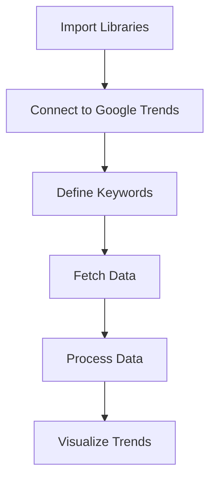

# 🚀 Google Keyword Trend Analysis

> 📊 *Analyze, Compare, and Visualize Google Search Trends for Data-Related Skills*

---

## 🌟 Project Overview

This project explores the popularity of key data-related topics using Google search trend data. It focuses on three important fields:

* **Data Science**
* **Machine Learning**
* **Data Analytics**

The goal is to understand how interest in these topics has changed over time and identify which skill is most in demand.

---

## 🎯 Objectives

* 🔍 Analyze search trends of data-related keywords
* 📈 Compare popularity over time
* 📊 Visualize trends using graphs
* 💡 Identify the most in-demand skill

---

## 🧠 Problem Statement

Choosing the right career path in the data field can be confusing. This project solves that problem by using real-world Google search data to show which technologies are trending and growing.

---

## 🗂️ Keywords Analyzed

* Data Science
* Machine Learning
* Data Analytics

🕒 **Time Period:** Last 12 months
🌍 **Region:** Worldwide

---

## 🛠️ Tech Stack

* 🐍 Python
* 📊 Pandas
* 📈 Matplotlib
* 🎨 Seaborn
* 🌐 Pytrends
* 📍 Plotly
* 📓 Jupyter Notebook

---

## ⚙️ Project Workflow

---

## 📊 Visualizations

✨ The project includes:

* 📈 **Trend Line Graph** – Shows interest over time
* 📊 **Keyword Comparison** – Compare multiple keywords
* 🌍 **Geographical Analysis** – Top countries searching keywords
* 🔥 **Interactive Charts** – Better data exploration

---

## 📌 Key Insights

* 🚀 **Machine Learning** has the highest search interest
* 📊 **Data Science** shows stable growth
* 📉 **Data Analytics** has lower but increasing demand

---

## 📁 Output

* ✔️ Line charts
* ✔️ Keyword comparison graphs
* ✔️ CSV file with trend data
* ✔️ (Optional) World map visualization

---

## 💡 Applications

This project is useful for:

* 🎓 Students choosing career paths
* 💼 Professionals tracking trends
* 🏢 Businesses analyzing market demand
* 📊 Data analysts & researchers

---

## 🏁 Conclusion

The project clearly shows that **Machine Learning is the most popular and trending skill**, followed by **Data Science**, while **Data Analytics is steadily growing**.

👉 This highlights the increasing demand for data and AI-related skills in today's world.

---

## 🔮 Future Improvements

* ➕ Add more keywords
* 🌎 Region-based analysis
* 📊 Build dashboard (Power BI / Tableau)
* 🤖 Predict future trends using ML
* 🔄 Automate data updates

---

## 👨‍💻 Author

**Prabhat Prajapati**

---

## ⭐ If you like this project

Give it a ⭐ on GitHub and share it with others!

---
